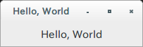
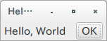
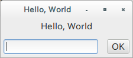

# コンテナ(container)とウィジット(widget)

## ラベル ウィジットの追加
今度はできたウィンドウにラベルを追加してみます。

ラベルを追加するには、Labelインスタンスを作成し、windowに[add](http://gtk-rs.org/docs/gtk/trait.ContainerExt.html#tymethod.add)するだけです。このLabelのようなUI部品を、Gtk+では「ウィジット(widget)」といいます。

```rust
extern crate gtk;

use gtk::prelude::*;

fn main() {
    gtk::init().expect("Failed to initialize GTK.");

    let window = gtk::Window::new(gtk::WindowType::Toplevel);
    window.set_title("Hello, World");
    
    let label = gtk::Label::new(Some("Hello, World"));
    window.add(&label);
    
    window.show_all();
    
    gtk::main();
}
```



## Buttonを追加すると…？
では試しに[Button](http://gtk-rs.org/docs/gtk/struct.Button.html)ウィジットをaddしてみましょう。

```rust
let label = gtk::Label::new(Some("Hello, World"));
window.add(&label);

let button = gtk::Button::new_with_label("OK");
window.add(&button);
```

実行すると、以下のようなエラーが出力されます。

> (hello:5518): Gtk-WARNING **: Attempting to add a widget with type GtkButton to a GtkWindow, but as a GtkBin subclass a GtkWindow can only contain one widget at a time; it already contains a widget of type GtkLabel

エラーは、GtkBinのサブクラスであるGtkWindowはひとつのウィジットしか含められないと言っています。どういうことでしょうか。

## コンテナを追加
Windowのように、他のコンテナをもつことができるウィジットをGtk+では「コンテナ(Container)」といいます。
Windowは、[Bin](http://gtk-rs.org/docs/gtk/struct.Bin.html)というひとつのウィジットを持つことができるコンテナです。

もし先の例のように、複数個のウィジットを追加したい場合は、他のコンテナを使う必要があります。ここでは、一番よく使われる「[Box](http://gtk-rs.org/docs/gtk/struct.Box.html)」というコンテナを使ってみましょう。このコンテナはウィジットを縦あるいは横に並べることができます。

```rust
extern crate gtk;

use gtk::prelude::*;


fn main() {
    gtk::init().expect("Failed to initialize GTK.");

    let window = gtk::Window::new(gtk::WindowType::Toplevel);
    window.set_title("Hello, World");
    
    let hbox = gtk::Box::new(gtk::Orientation::Horizontal, 5);
    
    let label = gtk::Label::new(Some("Hello, World"));
    hbox.pack_start(&label, true, true, 5);
    
    let button = gtk::Button::new_with_label("OK");
    hbox.pack_start(&button, false, false, 5);

    window.add(&hbox);
    window.show_all();
    
    gtk::main();
}
```

動作させると、このようになります。



Boxもコンテナであるため、もちろんWindowと同様にadd()することができます。しかし、広げるかどうかなどのパラメータをいくつか与えた方が便利であるため、普通は[pack_start](http://gtk-rs.org/docs/gtk/trait.BoxExt.html#tymethod.pack_start)あるいは[pack_end](http://gtk-rs.org/docs/gtk/trait.BoxExt.html#tymethod.pack_end)を利用します。

## コンテナのネスト
コンテナもウィジットのため、コンテナをコンテナの中に入れることができます。

例として、ラベルの下に1行テキスト入力とボタンを置く画面を作ると、以下のようになります。
[Entry](http://gtk-rs.org/docs/gtk/struct.Entry.html)が1行のテキストを入力するためのウィジットです。

```rust
extern crate gtk;

use gtk::prelude::*;


fn main() {
    gtk::init().expect("Failed to initialize GTK.");

    let window = gtk::Window::new(gtk::WindowType::Toplevel);
    window.set_title("Hello, World");

    let vbox = gtk::Box::new(gtk::Orientation::Vertical, 5);
    let label = gtk::Label::new(Some("Hello, World"));
    vbox.pack_start(&label, false, false, 5);
    
    let hbox = gtk::Box::new(gtk::Orientation::Horizontal, 5);
    
    let entry = gtk::Entry::new();
    hbox.pack_start(&entry, false, false, 5);
    
    let button = gtk::Button::new_with_label("OK");
    hbox.pack_start(&button, false, false, 5);
    
    vbox.pack_start(&hbox, true, true, 5);

    window.add(&vbox);
    window.show_all();
    
    gtk::main();
}
```

動作させると、このようになります。



もしコードでUIを組み立てる場合は、様々なウィジットを活用しながら、コンテナに詰めていくという作業の繰り返しになります。
