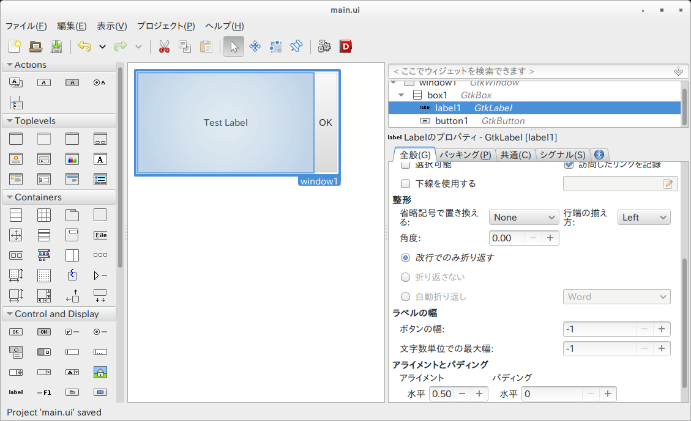

# Gladeの活用
以前の章のようにUIをコードで記述していけば、UIを作ることができますが、命令的な記述では手間がかかります。
そこで登場するのが、[Glade](https://glade.gnome.org/)というGtk+アプリケーションのUIデザイナーです。

## GladeでのUIの作成
glade &でGladeを起動すると、UIデザインの画面が表示されるので、そこでウィジットをドラッグアンドドロップで配置していきます。



あとは、「ファイル＞名前をつけて保存」によりUIの定義が記述されたXMLファイルを保存します。ここでは、ファイルパスをsrc/resources/main.ui とします。

## BuilderによるUI定義ファイルの呼び出し
GtkBuilderを利用すると、Gladeで保存したファイルからUIを作成することができます。Rustのinclude_str!マクロを利用すると、コンパイル時に文字列にしておいてくれるため、さらに便利です。

保存したmain.uiを表示するには、[Builder](http://gtk-rs.org/docs/gtk/struct.Builder.html#method.new_from_string)を作り、必要に応じて[get_object](http://gtk-rs.org/docs/gtk/struct.Builder.html#method.get_object)で取り出してシグナルを接続します。

```rust
extern crate gtk;

use gtk::prelude::*;

fn main() {
    gtk::init().expect("Failed to initialize GTK.");

    let ui = include_str!("resources/main.ui");
    let builder = gtk::Builder::new_from_string(ui);
    
    let window1 : gtk::Window = builder.get_object("window1").unwrap();
    window1.connect_delete_event(move |_, _| {
        gtk::main_quit();
        Inhibit(false)
    });

    window1.show_all();
    
    gtk::main();
}
```

get_object()は、型がわからないため、明示的に型を指示します。

