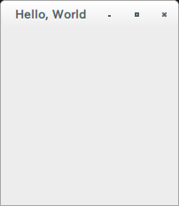

# Hello, World
まずは、プロジェクトを作成し、ウィンドウを表示します。

## プロジェクトの作成
cargoでプロジェクトを作成します。
```
$ cargo new hello --bin
```

作成されたhello/Cargo.tomlにgtkを追加します。
```
[dependencies]
gtk = { version = "0.0.7", features = ["v3_10"] }
```

buildして、エラーにならないことを確認します。
```
$ cargo build
```

これでプロジェクトの作成は完了です。

## ウィンドウの表示
ウィンドウを表示するコードを、以下のようにsrc/main.rs に記述します。

gtk::init()を呼び出し、[gtk::Window](http://gtk-rs.org/docs/gtk/struct.Window.html#method.new)を作成/表示後、gtk::main()でメインループに入ります。

```rust
extern crate gtk;

use gtk::prelude::*;

fn main() {
    gtk::init().expect("Failed to initialize GTK.");

    let window = gtk::Window::new(gtk::WindowType::Toplevel);

    window.set_title("Hello, World");
    window.show_all();
    
    gtk::main();
}
```

cargoコマンドを以下の通り実行し、ウィンドウが表示されれば、Hello, World成功です！
```
$ cargo run
```
 
 

ウィンドウを閉じたときに終了するコードを書いていないため、Ctrl+Cで終了させます。

