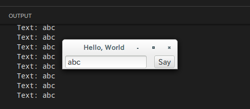
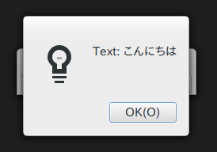

# シグナル（イベント）
さて、ウィジットを配置することができるようになりましたが、相変わらずきちんと終了しないままです。
ウィンドウを閉じたときにアプリケーションを終了させるようにしましょう。

ウィンドウを閉じたときにアプリケーションを終了させるには、[connect_delete_event](http://gtk-rs.org/docs/gtk/trait.WidgetSignals.html#tymethod.connect_delete_event)に関数を渡します。

最初のHello, Worldウィンドウを閉じたときに終了させるようにするには、以下のように記述します。
```rust
extern crate gtk;

use gtk::prelude::*;

fn main() {
    gtk::init().expect("Failed to initialize GTK.");

    let window = gtk::Window::new(gtk::WindowType::Toplevel);

    window.set_title("Hello, World");
    
    window.connect_delete_event(|_, _| {
        gtk::main_quit();
        Inhibit(false)
    });

    window.show_all();
    
    gtk::main();
}
```
渡す関数には、Self(=window)とEventが渡ってきますが、どちらもここでは必要ないので_で無視します。
関数の返り値となる「[Inhibit](http://gtk-rs.org/docs/gtk/struct.Inhibit.html)」はデフォルトハンドラを実行するかどうかを意味する値です。ここではどちらでもよいですが、falseを返しておきます。

このように、何かの契機で処理するための仕組みをGtk+ (が利用しているGLib Object System）では「シグナル」といっています。

## ウィジットの値をハンドラ中で利用する
先の例に、1行テキスト入力とボタンを追加して、ボタンが押されたらコンソールに内容を表示するようにしてみましょう。

Buttonのクリックに反応するようにするには、[connect_clicked](http://gtk-rs.org/docs/gtk/trait.ButtonSignals.html#tymethod.connect_clicked)を使います。

```rust
extern crate gtk;

use gtk::prelude::*;

fn main() {
    gtk::init().expect("Failed to initialize GTK.");

    let window = gtk::Window::new(gtk::WindowType::Toplevel);

    window.set_title("Hello, World");
    
    window.connect_delete_event(|_, _| {
        gtk::main_quit();
        Inhibit(true)
    });

    let hbox = gtk::Box::new(gtk::Orientation::Horizontal, 5);
    
    let entry = gtk::Entry::new();
    hbox.pack_start(&entry, true, true, 5);
    
    let button = gtk::Button::new_with_label("Say");
    button.connect_clicked(move |_| {
        println!("Text: {}", entry.get_text().unwrap());
    });
    
    hbox.pack_start(&button, false, false, 5);
    
    window.add(&hbox);
    window.show_all();
    
    gtk::main();
}
```

動作させると、このような形になります。



ここで大事なことは、クロージャにmoveキーワードを付与し、button変数の所有権をクロージャに移動させているところです。移動させないと、変数「entry」よりもクロージャのほうが長く生きる可能性があるため、変数の借用（borrow）では実際使うタイミングで変数がいなくなっている可能性があるとコンパイラが判断するためです。

外してコンパイルすると、その旨のエラーが出力されるのでわかります。

> src/main.rs:24:28: 26:6 error: closure may outlive the current function, but it borrows `entry`, which is owned by the current function [E0373]  
> src/main.rs:24     button.connect_clicked(|_| {  
> src/main.rs:25         println!("Text: {}", entry.get_text().unwrap());  
> src/main.rs:26     });  
> src/main.rs:24:28: 26:6 help: run `rustc --explain E0373` to see a detailed explanation  
> src/main.rs:25:30: 25:35 note: `entry` is borrowed here  
> src/main.rs:25         println!("Text: {}", entry.get_text().unwrap());  
>                                             ^~~~~  
> （略）  
> src/main.rs:24:28: 26:6 help: to force the closure to take ownership of `entry` (and any other referenced variables), use the `move` keyword, as shown:  
> src/main.rs:       button.connect_clicked(move |_| {  
> src/main.rs:           println!("Text: {}", entry.get_text().unwrap());""  
> src/main.rs:       });  

### メッセージダイアログの表示
今度はprintln!()ではなく、メッセージダイアログを表示してみましょう。

メッセージダイアログを表示する例は、以下のようになります。

```rust
extern crate gtk;

use gtk::prelude::*;

fn main() {
    gtk::init().expect("Failed to initialize GTK.");

    let window = gtk::Window::new(gtk::WindowType::Toplevel);

    window.set_title("Hello, World");
    
    window.connect_delete_event(|_, _| {
        gtk::main_quit();
        Inhibit(true)
    });

    let hbox = gtk::Box::new(gtk::Orientation::Horizontal, 5);
    
    let entry = gtk::Entry::new();
    hbox.pack_start(&entry, true, true, 5);
    
    let button = gtk::Button::new_with_label("Say");
    
    let window_ = window.clone();
    button.connect_clicked(move |_| {
        let message = format!("Text: {}", entry.get_text().unwrap());
        
        let dialog = gtk::MessageDialog::new(
            Some(&window_),
            gtk::DialogFlags::empty(),
            gtk::MessageType::Info,
            gtk::ButtonsType::Ok,
            &message
        );
        dialog.run();
        dialog.destroy();
    });
    
    hbox.pack_start(&button, false, false, 5);
    
    window.add(&hbox);
    window.show_all();
    
    gtk::main();
}
```



MessageDialog::newの第1引数には、windowのOptionを渡しますが、windowそのものの所有権をmoveで
クロージャに渡してしまうと、あとで使うはずのwindowが使えなくなってしまいます。そのため、clone()したものをクロージャで使います。

gtk::Windowのclone()は、Gtk+で利用しているGObjectのリファレンスカウントを増加させるもので、deep copyされるわけではありません。

なお、clone()しないとこのようなエラーが出力されます。clone()が必要かも、とエラーで言っています。
> src/main.rs:41:5: 41:11 error: use of moved value: `window` [E0382]  
> src/main.rs:41     window.add(&hbox);  
>                    ^~~~~~  
> src/main.rs:41:5: 41:11 help: run `rustc --explain E0382` to see a detailed explanation  
> src/main.rs:25:28: 37:6 note: `window` moved into closure environment here because it has type `gtk::auto::window::Window`, which is non-copyable  
> src/main.rs:25     button.connect_clicked(move |_| {  
> src/main.rs:26         let message = format!("Text: {}", entry.get_text().unwrap());  
> src/main.rs:27           
> src/main.rs:28         let dialog = gtk::MessageDialog::new(  
> src/main.rs:29             Some(&window),  
> src/main.rs:30             gtk::DialogFlags::empty(),  
>                ...  
> src/main.rs:25:28: 37:6 help: perhaps you meant to use `clone()`?  

ここまで来れば、すでに簡単なアプリケーションが作れるようになっているはずです。

